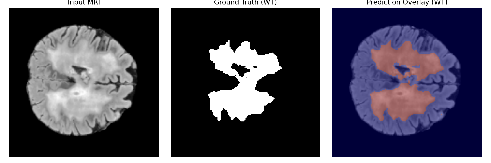
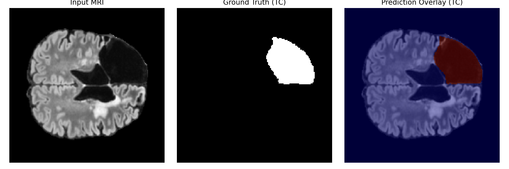
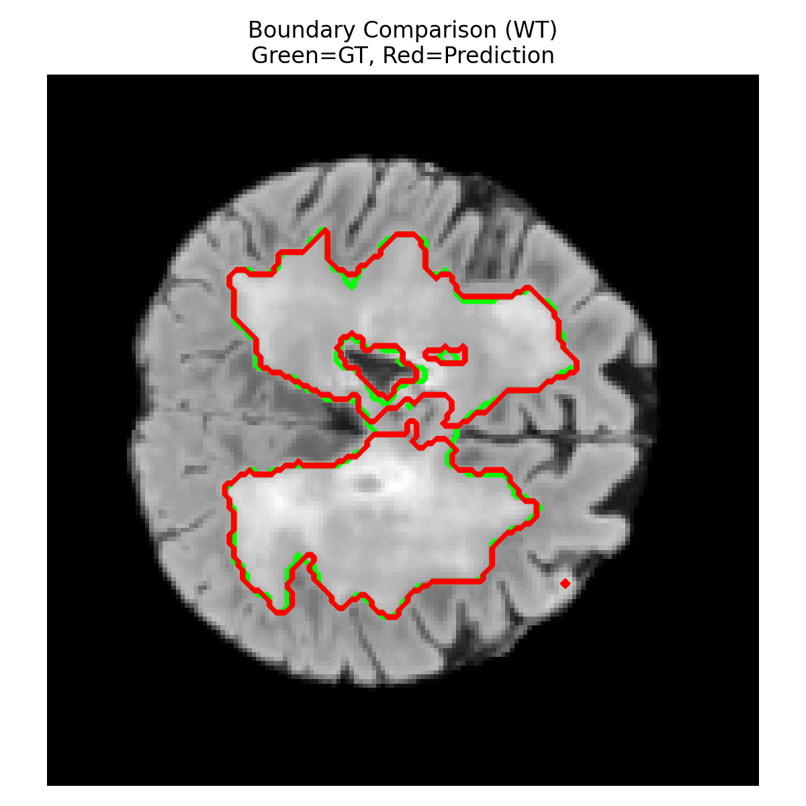
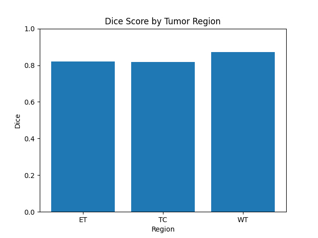
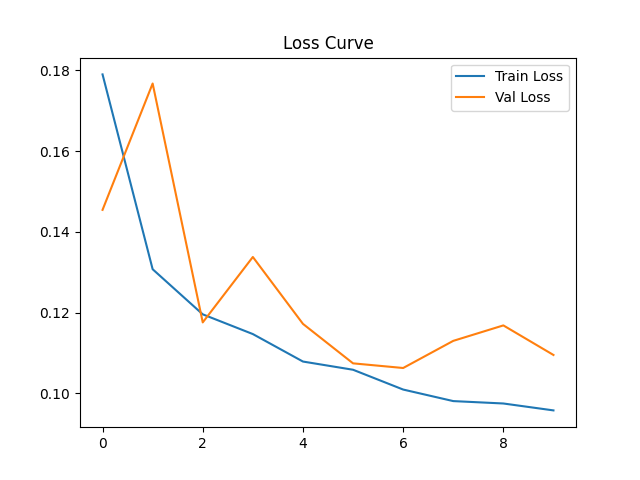
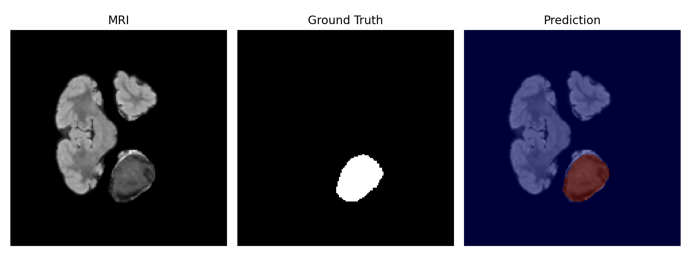
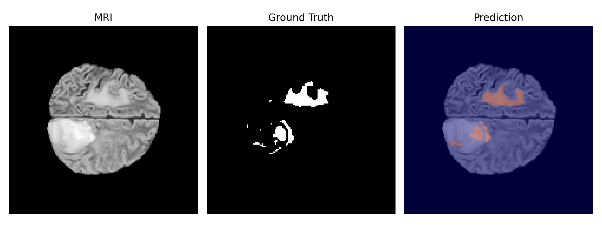
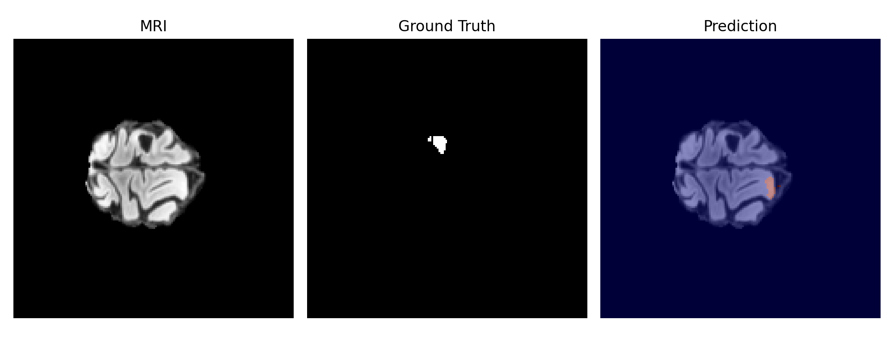

# BC-TSEA-UNet — Multi-Region Brain Tumor Segmentation on BraTS MRI

2D slice-based segmentation of the three clinical brain-tumor sub-regions from multi-modal MRI, in TensorFlow/Keras.

## Problem and approach

Gliomas are graded and treatment-planned from four co-registered MRI sequences (T1, T1ce, T2, FLAIR), and clinicians care about three nested sub-regions rather than one blob: whole tumor (WT, everything abnormal including edema), tumor core (TC, the necrotic and enhancing parts), and enhancing tumor (ET, the contrast-taking rim). ET is the hardest of the three — it is often a thin ring occupying well under 1% of a slice — so a network trained on plain cross-entropy learns to under-segment it and still scores well on average. This project addresses that with a U-Net whose every encoder and decoder stage is gated by a pair of stacked squeeze-and-excitation blocks (a "twin SE" block), trained on a composite loss that adds a dedicated Dice term and a dedicated Sobel-edge boundary term for ET on top of the all-region terms. Input is a 4-channel 160×160 axial slice; output is three independent sigmoid maps rather than a softmax, because the regions are nested and a pixel legitimately belongs to more than one of them. This was a six-member university team project.

## Results

Held-out test split (10% of patients, never seen in training or validation). Distance metrics are in **pixels at 160×160 resolution**, not millimetres.

| Region | Dice | IoU | HD95 (px) | ASSD (px) |
|:---|---:|---:|---:|---:|
| Whole Tumor (WT) | 0.87 | 0.77 | 11.66 | 3.61 |
| Tumor Core (TC) | 0.81 | 0.69 | 3.55 | 1.21 |
| Enhancing Tumor (ET) | 0.82 | 0.69 | 2.23 | 0.76 |

### Comparison against ablations

Dice, same data and split:

| Model | ET | TC | WT |
|:---|---:|---:|---:|
| Vanilla U-Net | 0.696 | 0.765 | 0.777 |
| SE-UNet | 0.809 | 0.829 | **0.862** |
| BC-TSEA-UNet (this repo) | **0.821** | 0.817 | **0.873** |

Adding channel attention is what moves the needle: plain SE recovers most of the gap over vanilla U-Net (+0.113 ET, +0.085 WT). The twin-SE blocks and the ET-weighted boundary loss add a further +0.012 ET and +0.011 WT on top of that. **SE-UNet beats this model on tumor core** (0.829 vs 0.817) — the extra ET-specific loss weighting appears to trade a little core accuracy for enhancing-tumor accuracy. The baseline rows come from the team's ablation experiments; the training scripts for those two variants are not in this repository (see [Limitations](#limitations)).

### Figures

Per-region predictions on a test slice:

| Whole Tumor | Tumor Core | Enhancing Tumor |
|:---:|:---:|:---:|
|  |  |  |

Contour agreement for WT — ground truth in green, prediction in red. Where only red is visible the two contours coincide:



Per-region Dice and the training curve (10 epochs; early stopping fired before the 12-epoch cap):

| Dice by region | Loss |
|:---:|:---:|
|  |  |

Best, median, and worst test slices by per-slice WT Dice. The worst case is the informative one — a slice with a tiny annotated lesion where the model floods most of the brain with a false-positive WT prediction:

| Best | Average | Worst |
|:---:|:---:|:---:|
|  |  |  |

## How it works

### 1. Preprocessing — `src/data/preprocess.py`

Per patient, per modality: z-score normalization over the whole volume, then SimpleITK **histogram matching of T1ce, T2, and FLAIR onto T1** as the reference. Histogram matching is doing the work that N4 bias-field correction would otherwise do for cross-scanner intensity drift; N4 is implemented (`n4_bias_correction_fast`) but disabled by default because it dominated preprocessing time on CPU for little measured benefit.

Volumes are sliced axially, resized to 160×160 (bilinear for images, **nearest-neighbour for masks** so label values are never interpolated into non-existent classes), and the label map is expanded into the three nested regions:

```
ET = (seg == 4)
TC = (seg == 1) | (seg == 4)
WT = (seg == 1) | (seg == 2) | (seg == 4)
```

**Slices with no annotated tumor are dropped.** This makes training tractable — most axial slices in a BraTS volume contain no tumor at all — but it has a direct cost at evaluation time, discussed in Limitations. Each patient becomes one compressed `.npz` holding `X: (N, 160, 160, 4)` and `Y: (N, 160, 160, 3)`, so training reads a handful of files instead of thousands of NIfTI volumes.

### 2. Splitting — `src/dataset.py`

80/10/10 **at the patient level**, with a fixed seed, so no slice from a training patient can appear in validation or test. Slice-level splitting would leak badly here: adjacent slices from one patient are near-duplicates, and a slice-level split inflates Dice by several points for free. Train and evaluation import the same `patient_splits()` function so the definition cannot drift between the two scripts.

### 3. Model — `src/models/unet.py`

A 4-level U-Net, 32 → 64 → 128 → 256 filters with a 512-filter bottleneck. Each stage is a double 3×3 conv + BN + ReLU, followed by a **twin SE block**: two `BN → ReLU → squeeze-excite` stages in series. A single SE gate applies one global channel re-weighting; stacking two with a normalization between them lets the second gate re-weight channels *after* the first has already suppressed some, which is a cheap way to sharpen the channel selection at every scale. With four input modalities carrying very different information about each region — ET is essentially a T1ce phenomenon, WT edema is a FLAIR phenomenon — per-channel gating is the natural place to spend parameters.

Two details worth noting:

- **Skip connections carry the gated features** (`s1..s4`), not the raw conv outputs, so the decoder sees the same channel weighting the encoder settled on.
- **The head is three independent sigmoids, not a softmax.** ET ⊂ TC ⊂ WT, so the classes are not mutually exclusive and a softmax would force them to compete for probability mass.

### 4. Loss — `src/models/losses.py`

```
0.35 · BCE
0.20 · Dice        (all three regions)
0.20 · Dice        (ET channel only)
0.15 · Sobel edge  (all three regions)
0.10 · Sobel edge  (ET channel only)
```

Each term is there for a reason. BCE keeps gradients sane early in training, when Dice on mostly-empty masks is near-degenerate. The Dice terms carry region overlap and are insensitive to the enormous background class. The boundary terms compare **Sobel edge-magnitude maps** of target and prediction: Dice is dominated by region interiors, so a blurred or slightly displaced contour barely costs anything, and the edge terms penalize exactly that — they target HD95/ASSD directly. ET gets a duplicate of both the overlap and the boundary term because it is small enough to be ignored by the all-region versions. The weights were set by hand, not searched.

Class imbalance is attacked from a second direction in the input pipeline: slices containing more than 30 ET pixels are **yielded twice** by the generator, roughly doubling ET's weight in an epoch without touching the loss.

### 5. Training — `src/train.py`

Adam at 5e-4, batch size 4, up to 12 epochs, `ModelCheckpoint` on `val_loss` and early stopping with patience 3 and `restore_best_weights`. The committed loss curve shows 10 epochs, so early stopping fired. Small batches and few epochs reflect that this was trained on a laptop CPU/MPS, not on a cluster.

### 6. Inference and scoring — `src/evaluate.py`

Thresholds are **per region, not uniform**: ET at 0.40, TC and WT at 0.50. ET is systematically under-confident because of its size, and lowering only its threshold recovers recall without disturbing the other two.

Metrics: Dice, IoU, sensitivity, specificity are **micro-averaged** — true/false positive counts accumulate across every test slice before the ratio is taken, so large tumors dominate. HD95 and ASSD are computed per slice from symmetric surface distance transforms and then averaged, skipping slices where either mask is empty.

## Repository layout

```
src/
├── config.py               # paths, image size, channel/region names, split seed
├── dataset.py              # patient-level splits + tf.data pipelines
├── data/
│   ├── inspect_dataset.py  # sanity-check the raw download
│   └── preprocess.py       # NIfTI -> normalized 160x160 slices -> .npz cache
├── models/
│   ├── unet.py             # BC-TSEA-UNet
│   └── losses.py           # Dice / Sobel-boundary / hybrid loss
├── train.py
├── evaluate.py             # metrics -> results/metrics/final_metrics.csv
└── viz/
    ├── plot_metrics.py     # bar charts + curves, read from saved artifacts
    ├── slice_analysis.py   # best / median / worst slice by per-slice Dice
    └── qualitative.py      # 4 modalities + GT + prediction panels
results/                    # committed figures (weights and caches are gitignored)
```

## Setup

Requires Python 3.9+.

```bash
git clone https://github.com/SuhaasChunduru/Brain-tumor-Detection-.git
cd Brain-tumor-Detection-
python -m venv .venv && source .venv/bin/activate
pip install -r requirements.txt
```

### Data

The BraTS dataset is not redistributable and is not in this repo. Download it from the [BraTS challenge](https://www.synapse.org/brats) and place it so that each patient folder sits directly under the configured path:

```
data/BraTS_Dataset/training_data1_v2/
└── <patient_id>/
    ├── <patient_id>-t1n.nii.gz    # T1
    ├── <patient_id>-t1c.nii.gz    # T1ce
    ├── <patient_id>-t2w.nii.gz    # T2
    ├── <patient_id>-t2f.nii.gz    # FLAIR
    └── <patient_id>-seg.nii.gz    # labels
```

Adjust `DATASET_PATH` in [`src/config.py`](src/config.py) if your layout differs. **Check your label encoding before preprocessing:** this code maps `ET = (seg == 4)`, the BraTS 2021-and-earlier convention. BraTS 2023 re-encodes enhancing tumor as `3`; if your download uses that, set `LABEL_ET = 3` in [`src/data/preprocess.py`](src/data/preprocess.py) or the ET channel will come out empty.

## Running

All commands run from the repository root, as modules, in this order:

```bash
python -m src.data.inspect_dataset    # optional: confirm the download is laid out as expected
python -m src.data.preprocess         # NIfTI -> data/cache_npz/*.npz  (slow, one-time)
python -m src.train                   # -> results/models/best_model.keras + history
python -m src.evaluate                # -> results/metrics/final_metrics.csv
python -m src.viz.plot_metrics        # -> results/plots/*.png
python -m src.viz.slice_analysis WT   # -> results/multi_analysis/*.png  (or ET / TC)
python -m src.viz.qualitative 5       # -> results/advanced_visuals/*.png
```

A clean clone has no trained weights — `results/models/` is gitignored — so `src.evaluate` requires running `src.train` first.

## Limitations

These are real constraints on what the numbers above mean. Read them before comparing against published BraTS results.

- **The reported scores are not comparable to BraTS leaderboard scores.** Three reasons compound: metrics are micro-averaged over slices rather than computed per patient and then averaged (large tumors dominate); the model is 2D per-slice with no 3D context or 3D post-processing; and HD95/ASSD are 2D distances in pixels on downsampled 160×160 slices, not 3D distances in millimetres. The Dice figures are the closest to comparable, and even those are optimistic for the next reason.

- **Evaluation only ever sees tumor-bearing slices.** Preprocessing discards slices whose label map is empty, so they are absent from the test split too. The model is never scored on healthy tissue, which means these numbers say nothing about its false-positive rate on a normal brain — the exact failure mode that matters clinically. The worst-case figure above shows the model flooding a nearly-tumor-free slice with a false-positive WT prediction; systematically, that behaviour is invisible to this evaluation protocol.

- **The WT distance metrics are much worse than the overlap metrics suggest.** WT has the best Dice (0.87) but by far the worst HD95 (11.66 px vs 2.23 for ET) and ASSD (3.61 px vs 0.76). That gap is the signature of scattered false-positive components far from the true tumor: they cost little Dice against a large region but dominate a 95th-percentile surface distance. Any deployment would need connected-component filtering that this pipeline does not do.

- **Slices where either mask is empty are dropped from the HD95/ASSD averages** rather than counted as a maximum penalty. A complete miss on a small lesion therefore improves the distance metrics instead of hurting them.

- **The baseline comparison is not reproducible from this repository.** No training code for vanilla U-Net or SE-UNet is committed; those numbers come from the team's separate ablation runs and cannot be re-derived from a clean clone. Treat them as reported, not verified.

- **Single run, no confidence intervals, no seed control for training.** Every number comes from one training run. Only the data split is seeded; TensorFlow's weight initialization and shuffling are not, so re-running will not reproduce these figures exactly. The ~0.01 Dice differences in the ablation table are well within the range that run-to-run variance could explain, and no repeated-run study was done to rule that out.

- **No data augmentation and a small compute budget.** No flips, rotations, elastic deformation, or intensity jitter; batch size 4; 12-epoch cap. The loss curve shows training loss still falling when early stopping triggered on a noisy validation signal, so the model is likely under-trained rather than converged.

- **Validation and model selection use the same 10% split throughout**, and the per-region thresholds (ET at 0.40) were chosen by inspection rather than tuned on validation and frozen. There is mild optimistic bias in the test numbers from that.

- **Some committed figures under `results/figures/` and `results/plots/` predate the current scripts.** `src/viz/plot_metrics.py` regenerates everything in `results/plots/` from saved artifacts, but the per-region figures in `results/figures/` were produced by an ad-hoc script that was not preserved.

- **The committed `results/advanced_visuals/sample_*.png` files have swapped modality labels** — the panel labelled "T2" is actually T1ce and vice versa. The bug was in the plotting script's hardcoded titles only; it never affected training, the data, or any metric. [`src/viz/qualitative.py`](src/viz/qualitative.py) now derives panel titles from the same channel-order constant the preprocessing uses, so re-running it produces correctly labelled figures.

- **Research code, not a clinical tool.** No regulatory validation, no external-cohort testing, no uncertainty estimates.

## Credits

Six-member university team project. This repository holds the segmentation pipeline: preprocessing, model, training, evaluation, and visualization.

- GitHub: [@SuhaasChunduru](https://github.com/SuhaasChunduru)
- Portfolio: [portfolio-mu-green-bx99x7dm7s.vercel.app](https://portfolio-mu-green-bx99x7dm7s.vercel.app/)

Licensed under the MIT License — see [LICENSE](LICENSE).
